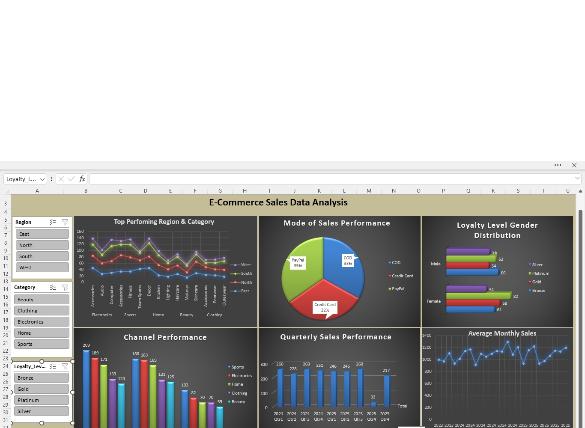

# E-Commerce Sales Analysis (Excel)

## Project Overview
This project presents a descriptive and exploratory analysis of a 2,000-transaction e-commerce dataset covering the period from 2023 to 2025. The analysis focuses on sales trends, regional performance, category contribution, channel distribution, and customer behavior to support business decision-making.

## Business Objectives
- Evaluate overall sales performance
- Identify top-performing categories and regions
- Analyze seasonal sales trends
- Derive strategic business recommendations

## Dataset Details
- Total Records: 2,000
- Regions: 4
- Categories: 5
- Store Types: 3
- Time Span: 2023–2025

## Tools Used
- Microsoft Excel
- Power Query
- Pivot Tables
- Data Visualization

## Key Insights
- The North region leads overall sales performance
- Sports and Electronics are the top-performing categories
- The online channel contributes 41% of total sales
- Sales show a strong seasonal peak in Q4
- Female customers have a higher presence in premium loyalty tiers

## Business Recommendations
- Increase marketing efforts in the West region
- Expand inventory for Sports and Electronics
- Strengthen digital payment promotions
- Optimize online channel operations

## Dashboard Preview

## Conclusion
The analysis highlights a stable sales structure with clear opportunities for growth in digital channels, regional expansion, and high-performing product categories.

## Project Files
- Excel dashboard file
- Source dataset
- Dashboard image
- README.md

## Author
**Saranya D**  
Aspiring Data Analyst

## Tags
`Excel` `E-Commerce Analysis` `Sales Dashboard` `Data Analysis` `Data Visualization` `Power Query` `Pivot Tables` `Business Intelligence` `Customer Insights` `Portfolio Project`
